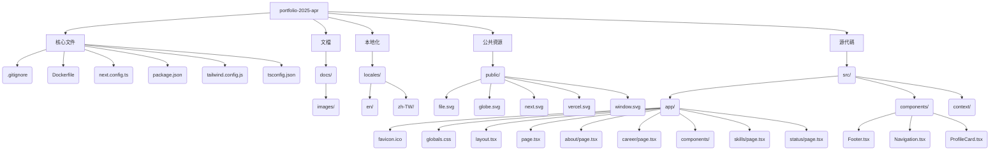

# 項目結構



# 開發注意事項

## 嚴禁事項
- **禁止使用簡體中文**: 程序中的comment應使用英文, 文檔中使用繁體中文, 任何情況下均嚴禁使用簡體中文

## 技術棧
- **Next.js**: v15.2.4 (使用 Turbopack)
- **React**: v19
- **Tailwind CSS**: v4
- **TypeScript**: v5

## 環境配置
1. **安裝依賴**:
   ```bash
   npm install
   ```

2. **開發模式**:
   ```bash
   npm run dev # 使用 Turbopack 加速
   ```

3. **生產構建**:
   ```bash
   npm run build
   ```

4. **代碼檢查**:
   ```bash
   npm run lint
   ```

## 核心配置
### Next.js (`next.config.ts`)
```typescript
import type { NextConfig } from "next";

const nextConfig: NextConfig = {
  output: 'standalone', // 啟用獨立輸出模式（適合Docker部署）
};

export default nextConfig;
```

### Tailwind CSS (`tailwind.config.js`)
- **主題顏色**:
  - 深色背景: `#0a0a0a`
  - 前景色: `#00ff41`
  - 強調色: `#ff00ff`, `#00ffff`, `#ffff00`
  
- **動畫效果**:
  - `flicker`: 閃爍動畫
  - `glitch`: 故障效果
  
- **字體**:
  ```javascript
  fontFamily: {
    'cyber': ['Share Tech Mono', 'monospace'],
  }
  ```

## 開發規範
1. **路由結構**:
   - 頁面組件位於 `src/app/[page]/page.tsx`
   - 公共組件位於 `src/components/`

2. **樣式指南**:
   - 使用 Tailwind 工具類優先
   - 自定義樣式在 `src/app/globals.css` 中定義
   - 避免直接使用內聯樣式

3. **多語言支持**:
   - 語言文件位於 `locales/` 目錄
   - 支持英文 (`en/`) 和繁體中文 (`zh-TW/`)

4. **靜態資源**:
   - 所有公共資源放在 `public/` 目錄
   - SVG 圖標可直接通過路徑引用

## 部署說明
1. **Docker 部署**:
   ```Dockerfile
   # 使用官方 Node.js 鏡像
   FROM node:20-alpine AS base
   
   # 設置工作目錄
   WORKDIR /app
   
   # 複製依賴文件
   COPY package.json package-lock.json ./
   
   # 安裝依賴
   RUN npm ci
   
   # 複製項目文件
   COPY . .
   
   # 構建應用
   RUN npm run build
   
   # 使用小型運行時鏡像
   FROM node:20-alpine AS production
   
   # 從構建階段複製文件
   COPY --from=base /app/.next/standalone ./
   COPY --from=base /app/.next/static ./.next/static
   COPY --from=base /app/public ./public
   
   # 暴露端口
   EXPOSE 3000
   
   # 啟動應用
   CMD ["node", "server.js"]