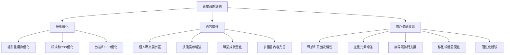

# Portfolio 2025 專案分析與改進計劃

## 1. 專案結構和技術棧分析

### 技術棧
- **框架**: Next.js 15.2.4 (App Router)
- **語言**: TypeScript (React 19.0.0)
- **樣式**: Tailwind CSS v4
- **部署**: Docker 容器化支援

### 專案結構
```
portfolio-2025-apr/
├── src/
│   ├── app/              # App Router 結構
│   │   ├── about/        # 關於頁面
│   │   ├── career/       # 職業生涯頁面
│   │   ├── skills/       # 技能頁面
│   │   ├── status/       # 狀態監控頁面
│   │   └── components/   # 頁面級組件
│   ├── components/       # 共用組件
│   └── context/          # Context API
├── public/               # 靜態資源
└── docs/                 # 文件
```

## 2. 現有功能和內容評估

### 現有頁面
1. **首頁** - 顯示基本介紹、工作經驗和連結
2. **關於頁面** - 個人簡介、教育背景、專業技能標籤
3. **技能頁面** - 分類展示技術技能（後端、前端、雲端、DevOps、測試）
4. **職業生涯頁面** - 詳細的工作經歷和教育背景
5. **狀態頁面** - 嵌入式系統狀態監控

### 設計風格
- **主題**: 賽博朋克風格
- **配色**: 黑色背景搭配青色、黃色、洋紅色強調
- **特效**: 發光效果、網格背景、故障效果

## 3. 改進機會識別

### 技術優化機會
- [ ] 重複的組件邏輯（如導航選取狀態）
- [ ] CSS 重構和優化
- [ ] 圖片優化和響應式處理
- [ ] SEO 和效能優化

### 內容增強機會
- [ ] 個人專案展示區
- [ ] 技能等級可視化
- [ ] 更詳細的職業成就量化
- [ ] 多語言支援完善

### 用戶體驗改進機會
- [ ] 移動端體驗優化
- [ ] 導航和頁面間流暢過渡
- [ ] 互動元素增強
- [ ] 無障礙訪問支援

## 4. 技術優化建議

### 4.1 組件重構與優化
1. **導航組件優化**
   - [ ] 將重複的導航邏輯提取到自定義 Hook
   - [ ] 統一活動連結的樣式處理
   - [ ] 優化移動端導航的動畫效果

2. **ProfileCard 組件改進**
   - [ ] 圖片加載優化（使用 next/image 的 blur-up 效果）
   - [ ] 錯誤處理增強
   - [ ] 可訪問性改進（添加適當的 aria 標籤）

3. **技能頁面性能優化**
   - [ ] 虛擬滾動實現（當技能項目較多時）
   - [ ] 圖標組件化（避免 dangerouslySetInnerHTML）
   - [ ] 動畫性能優化

### 4.2 樣式和 CSS 優化
1. **Tailwind CSS 最佳實踐**
   - [ ] 使用 @apply 指令減少重複類名
   - [ ] 創建自定義主題配置
   - [ ] 利用 Tailwind 的 JIT 模式優化構建

2. **響應式設計改進**
   - [ ] 完善不同屏幕尺寸的適配
   - [ ] 優化觸摸設備的交互區域大小
   - [ ] 改進橫屏模式下的顯示效果

3. **動畫性能優化**
   - [ ] 使用 CSS transform 和 opacity 代替改變佈局屬性
   - [ ] 利用 will-change 屬性提示瀏覽器優化
   - [ ] 減少過度使用的 glitch 效果（可能影響可讀性）

### 4.3 效能和 SEO 優化
1. **圖片優化**
   - [ ] 使用 next/image 組件替代原生 img 標籤
   - [ ] 實現響應式圖片（不同設備加載不同尺寸）
   - [ ] 添加適當的 alt 屬性

2. **代碼分割和懶加載**
   - [ ] 對大型組件實現動態導入
   - [ ] 優化第三方庫的加載策略
   - [ ] 實現路由級別的代碼分割

3. **SEO 優化**
   - [ ] 完善各頁面的 meta 標籤
   - [ ] 添加結構化數據（Schema.org）
   - [ ] 優化網站地圖和 robots.txt

## 5. 內容增強建議

### 5.1 個人專案展示區
1. **創建專案展示頁面**
   - [ ] 添加 `/projects` 路由
   - 展示個人開源項目和商業項目
   - 每個項目包含：簡介、技術棧、成果、GitHub 連結

2. **專案卡片組件**
   - 視覺化項目展示（截圖或 GIF）
   - 項目類型標籤（個人、團隊、開源等）
   - 項目時間線和角色說明

### 5.2 技能展示增強
1. **技能等級可視化**
   - 為各項技能添加熟練度評級（1-5 級）
   - 使用進度條或星級評分視覺化
   - 添加技能獲得時間線

2. **技術文章和教程連結**
   - 展示技術博客相關文章
   - 添加技術分享和演講連結
   - 提供開源貢獻證明

### 5.3 職業成就量化
1. **成就指標展示**
   - 量化工作成果（如：提升系統性能 X%）
   - 展示項目規模（用戶數、代碼行數等）
   - 添加推薦信或證書展示區

2. **職業發展時間軸**
   - 互動式時間軸展示職業發展
   - 關鍵里程碑和轉折點說明
   - 技能發展路徑圖

### 5.4 多語言內容完善
1. **繁體中文支援**
   - 完善繁體中文版本內容
   - 確保所有頁面都有對應的中文版本
   - 添加語言切換功能

2. **國際化內容策略**
   - 為不同語言版本定制化內容
   - 考慮文化差異對內容的影響
   - 實現動態語言切換

## 6. 用戶體驗改進建議

### 6.1 導航和頁面流暢性
1. **頁面過渡動畫**
   - 添加頁面切換的淡入淡出效果
   - 實現共享元素過渡動畫
   - 優化瀏覽器後退按鈕體驗

2. **導航體驗優化**
   - 添加麵包屑導航
   - 實現鍵盤導航支援
   - 優化導航選單的觸摸體驗

### 6.2 互動元素增強
1. **微交互設計**
   - 為按鈕添加懸停和點擊反饋
   - 為卡片添加懸停效果
   - 實現滾動觸發動畫

2. **表單和反饋**
   - 添加聯絡表單（與現有郵件連結整合）
   - 實現即時驗證反饋
   - 添加成功/錯誤狀態提示

### 6.3 無障礙訪問支援
1. **鍵盤導航**
   - 確保所有交互元素可通過鍵盤訪問
   - 添加適當的 focus 樣式
   - 實現跳過導航鏈接

2. **屏幕閱讀器支援**
   - 添加適當的 aria 標籤
   - 為裝飾性元素添加 aria-hidden
   - 為圖片添加描述性 alt 文本

### 6.4 移動端體驗優化
1. **響應式交互**
   - 優化觸摸目標大小
   - 實現手勢操作（如滑動切換）
   - 添加移動端專屬功能（如分享按鈕）

2. **性能優化**
   - 減少移動端不必要的動畫
   - 優化圖片加載策略
   - 實現懶加載和預加載

### 6.5 個性化體驗
1. **主題切換**
   - 實現深色/淺色主題切換
   - 保存用戶偏好設置
   - 添加自動主題檢測

2. **用戶偏好記憶**
   - 記住用戶的語言選擇
   - 保存導航菜單展開狀態
   - 記住技能分類篩選選項

## 7. 整體架構圖



## 8. 優先級建議

### 高優先級（立即執行）
1. 技術優化：
   - [ ] 圖片優化（使用 next/image）
   - [ ] SEO 優化（完善 meta 標籤）
   - [ ] 組件重構（導航組件優化）

2. 內容增強：
   - [ ] 完善現有頁面內容
   - [ ] 添加缺失的 alt 屬性

3. 用戶體驗：
   - [ ] 移動端響應式優化
   - [ ] 無障礙訪問基礎支援

### 中優先級（短期內執行）
1. 技術優化：
   - [ ] 動畫性能優化
   - [ ] 代碼分割和懶加載

2. 內容增強：
   - [ ] 個人專案展示區
   - [ ] 技能等級可視化

3. 用戶體驗：
   - [ ] 頁面過渡動畫
   - [ ] 微交互設計

### 低優先級（長期規劃）
1. 技術優化：
   - [ ] PWA 支援
   - [ ] 高級動畫效果

2. 內容增強：
   - [ ] 職業發展時間軸
   - [ ] 技術文章整合

3. 用戶體驗：
   - [ ] 個性化主題
   - [ ] 用戶偏好記憶

## 9. 實施建議

1. **分階段實施**：按照優先級分階段實現改進，確保每階段都有可見的成果
2. **持續集成**：使用 Git 分支策略，確保主分支的穩定性
3. **測試驅動**：在實現新功能前編寫測試用例
4. **性能監控**：使用工具監控改進後